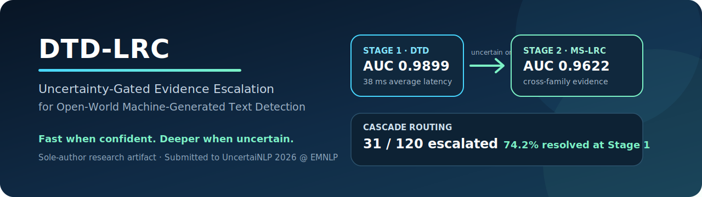

<p align="center">
  
</p>

<p align="center">
  <a href="https://huggingface.co/spaces/YohanChow/DTD-LRC-AI-Text-Detector"></a>
  <a href="https://youtu.be/Z0NXF_Ghasg"></a>
  <a href="paper/DTD-LRC_UncertaiNLP_2026/"></a>
  <a href="LICENSE"></a>
  
</p>

<p align="center">
  <strong>Fast when confident. Deeper when uncertain.</strong><br/>
  A sole-author research artifact for uncertainty-aware, evidence-assisted AI-text detection.
</p>

## Overview

**DTD-LRC** is a two-stage cascade for open-world machine-generated text detection:

- **DTD** performs fast, lightweight first-stage detection from lexical, stylistic, syntactic, punctuation, and repetition features.
- **MS-LRC** is activated only inside an uncertainty band and examines cross-family, cross-scale language-model evidence.
- The system returns not only a decision, but also uncertainty and diagnostic evidence intended for human review.

The workshop manuscript, **“DTD-LRC: Uncertainty-Gated Evidence Escalation for Open-World Machine-Generated Text Detection,”** has been submitted to **UncertaiNLP 2026 @ EMNLP** through OpenReview. Submission does not imply acceptance.

## Research contribution

The project studies a practical question:

> Can a detector preserve low-cost inference for clear cases while escalating only ambiguous samples to deeper, more interpretable evidence?

DTD-LRC contributes:

1. **Uncertainty-gated routing** rather than always-on expensive inference.
2. **Cross-family and cross-scale evidence** through NLL-per-byte response patterns.
3. **Ladder response curves and a family-scale matrix** for structured Stage-2 evidence.
4. **A reviewer-facing artifact** with a live demo, API, precomputed evidence cards, full local pipeline, manuscript files, and explicit claim boundaries.

## System architecture

```mermaid
flowchart LR
    A[Input text] --> B[Stage 1: DTD]
    B --> C{AI probability inside<br/>uncertainty band [0.41, 0.61]?}
    C -- No --> D[Return Stage-1 decision]
    C -- Yes --> E[Stage 2: MS-LRC]
    E --> F[NLL / byte across<br/>model families and scales]
    F --> G[Ladder response curves<br/>and family-scale matrix]
    G --> H[Escalated decision<br/>with interpretable evidence]
```

## Headline validation results

| Component | Metric | Value |
|---|---:|---:|
| Stage 1 — DTD | AUC | **0.9899** |
| Stage 1 — DTD | F1 | **0.9600** |
| Stage 1 — DTD | Precision / Recall | **0.96 / 0.96** |
| Stage 1 — DTD | Average latency | **38 ms** |
| Routing gate | Uncertainty band | **[0.41, 0.61]** |
| Stage 2 — MS-LRC smoke evaluation | AUC | **0.9622** |
| Stage 2 — MS-LRC smoke evaluation | Accuracy | **0.9333** |
| Stage 2 — MS-LRC smoke evaluation | F1 | **0.9375** |
| Cascade smoke evaluation | Stage-2 usage | **31 / 120** |

In the 120-example cascade smoke evaluation, **74.2% of samples were resolved at Stage 1**, while 25.8% were escalated.

These are internal artifact-validation results. They are not universal performance guarantees, and external comparisons require matched datasets, thresholds, preprocessing, and evaluation protocols. See [Reproducibility and Claim Boundaries](docs/reproducibility.md).

## Artifact links

| Artifact | Link |
|---|---|
| Interactive demo | [Hugging Face Space](https://huggingface.co/spaces/YohanChow/DTD-LRC-AI-Text-Detector) |
| Direct application | [Deployed app](https://yohanchow-dtd-lrc-ai-text-detector.hf.space) |
| Demonstration video | [YouTube](https://youtu.be/Z0NXF_Ghasg) |
| Manuscript files | [`paper/DTD-LRC_UncertaiNLP_2026/`](paper/DTD-LRC_UncertaiNLP_2026/) |
| Artifact manifest | [`ARTIFACT_LINKS.md`](ARTIFACT_LINKS.md) |

## Quick start

### Lightweight reviewer mode

This mode runs interactive DTD inference and displays precomputed MS-LRC evidence without loading transformer models during startup.

```bash
git clone https://github.com/haveanicedaymydear/AI-Text-Cascade-Detect.git
cd AI-Text-Cascade-Detect
python -m venv .venv
source .venv/bin/activate
pip install -r requirements.txt
python app.py
```

Windows PowerShell:

```powershell
.\.venv\Scripts\Activate.ps1
```

Open:

```text
http://127.0.0.1:5000
```

### Full local cascade

```bash
pip install -r requirements-full.txt
python src/cascade_demo_app.py
```

The full MS-LRC path requires transformer model downloads or cache and more memory than the lightweight artifact.

## API

Health check:

```bash
curl http://127.0.0.1:5000/api/health
```

Detection request:

```bash
curl -X POST http://127.0.0.1:5000/api/detect \
  -H "Content-Type: application/json" \
  -d '{"text":"The implementation of artificial intelligence systems requires careful evaluation of reliability."}'
```

Precomputed Stage-2 examples:

```bash
curl http://127.0.0.1:5000/api/mslrc_examples
curl http://127.0.0.1:5000/api/mslrc_examples?id=uncertain_sample
```

## Repository map

```text
.
├── app.py                          # Reviewer-facing Flask/API entry point
├── src/
│   ├── web_app.py                  # Original lightweight DTD application
│   └── cascade_demo_app.py         # Full local cascade
├── models/                         # Public model artifact(s)
├── examples/                       # Human, AI, uncertain, and MS-LRC examples
├── paper/DTD-LRC_UncertaiNLP_2026/ # Submitted manuscript files
├── templates/                      # Web interfaces
├── tests/                          # Project tests
├── docs/                           # Reproducibility notes and visual assets
├── requirements.txt                # Lightweight demo dependencies
└── requirements-full.txt           # Full local pipeline dependencies
```

## Demo modes

| Mode | Command | Purpose |
|---|---|---|
| Reviewer artifact | `python app.py` | Interactive DTD + precomputed MS-LRC evidence |
| Original DTD app | `python src/web_app.py` | Original trained DTD web/API application |
| Full local cascade | `python src/cascade_demo_app.py` | Transformer-backed Stage-2 execution |

## Limitations and responsible use

DTD-LRC is a probabilistic aid, not an authority. It should **not** be used as the sole basis for punitive academic, employment, authorship, moderation, or disciplinary decisions.

Known limitations include:

- false positives on short, formulaic, translated, heavily edited, creative, or stylistically unusual human writing;
- domain shift and generator shift;
- calibration drift under unseen distributions;
- reduced reliability on multilingual or code-mixed text unless separately evaluated;
- higher compute cost for full MS-LRC inference;
- vulnerability to future generators and deliberate evasion strategies.

Recommended use is **evidence-assisted review**: combine the output with contextual evidence, provenance, human judgment, and an appeal or correction process.

## Citation

Citation metadata is available in [`CITATION.cff`](CITATION.cff). Until a final archival publication exists, cite the repository and submitted manuscript as a research artifact:

```bibtex
@misc{zhou2026dtdlrc,
  author       = {Livan Zhou},
  title        = {DTD-LRC: Uncertainty-Gated Evidence Escalation for Open-World Machine-Generated Text Detection},
  year         = {2026},
  howpublished = {Sole-author manuscript submitted to UncertaiNLP 2026 @ EMNLP and open-source research artifact},
  url          = {https://github.com/haveanicedaymydear/AI-Text-Cascade-Detect}
}
```

## Author

**Livan Zhou**  
First Class Honours BSc in Computing Science  
[GitHub](https://github.com/haveanicedaymydear) · [Email](mailto:zhoulivan@gmail.com)

## License

Released under the [MIT License](LICENSE).
